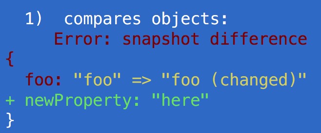
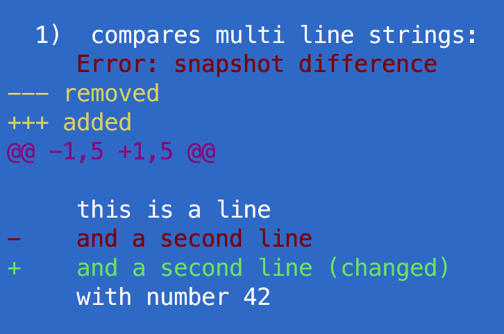

# snap-shot

Snapshot values are compared using
[variable-diff](https://github.com/taylorhakes/variable-diff) for objects
and [disparity](https://github.com/millermedeiros/disparity) for multi line
text.

## objects

Original object

```js
it('compares objects', () => {
  const o = {
    inner: {
      a: 10,
      b: 20
    },
    foo: 'foo (changed)',
    newProperty: 'here'
  }
  snapshot(o)
})
```

Changed object

```js
it('compares objects', () => {
  const o = {
    inner: {
      a: 10,
      b: 20
    },
    foo: 'foo'
  }
  snapshot(o)
})
```

Failed test message



## multi-line strings

Original text

```js
it('compares multi line strings', () => {
  snapshot(`
    this is a line
    and a second line
    with number 42
  `)
})
```

Changed text

```js
it('compares multi line strings', () => {
  snapshot(`
    this is a line
    and a second line (changed)
    with number 42
  `)
})
```

Failed test message


